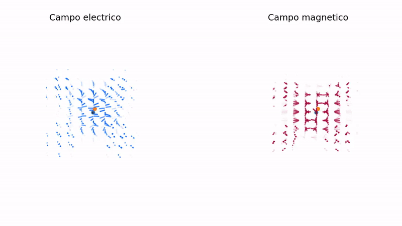

# Simulador de electrodinamica clasica
 ## Pasos a futuro para resolver el problema
 1. Calcular la densidad de corriente y la densidad de carga, considerando la posicion y velocidad de las particulas
 2. Resolver los campos(Evolución de la malla)
 3. Interpolar los campos(malla) para encontrar su efecto sobre las particulas
 4. Resolver las ecuaciones de movimiento para las particulas
 5. Exportar el codigo a python para facilitar sintaxis sin perder velocidad
 6. Graficación

 ## Pasos completados
  - [x] Fuentes de los campos
  - [x ] Evolución de los campos
  - [ ] Interpolación
  - [ ] Solución de las ecuaciones en particulas
  - [x] Exportar a python
  - [x] Graficar

## Salida del código

## Instrucciones de uso

### script3.py
El codigo cuenta con las siguientes variables
| Variable | Tipo | Descripción |
| :--- | :---: | ---: | 
| e0 | float | Constante de permitividad del vacio |
| mu0 | float | Constante de permeabilidad del vacio |
| res | int | Puntos en la malla en cada eje,el tamaño de la malla será de $\text{res}\times \text{res}\times \text{res}$
| min_ | float | Limite inferior para los ejes xyz |
| max_ | float | Limite superior para los ejes xyz |
| steps | int  | Numero de pasos en la simulación |
| s | int | Adelgazamiento de los vectores, para que en la animación no se solapen, $res/s$ debe ser entero
| dt | float | Tamaño de cada salto de la simulación |

